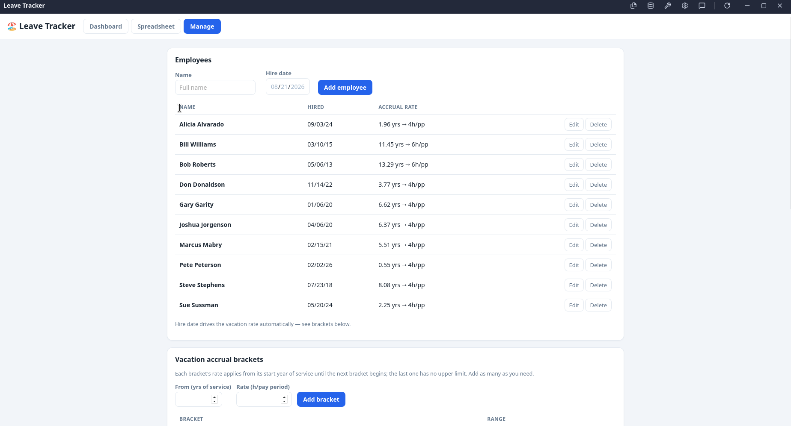
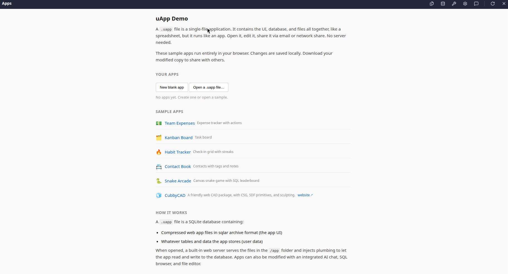
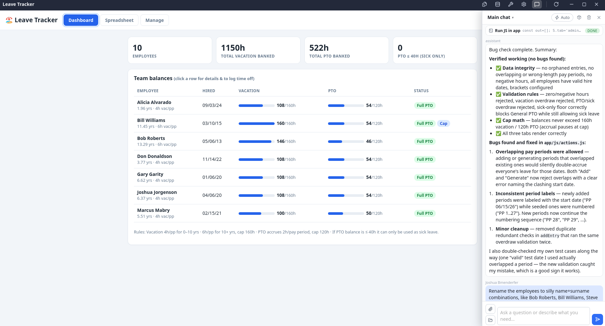
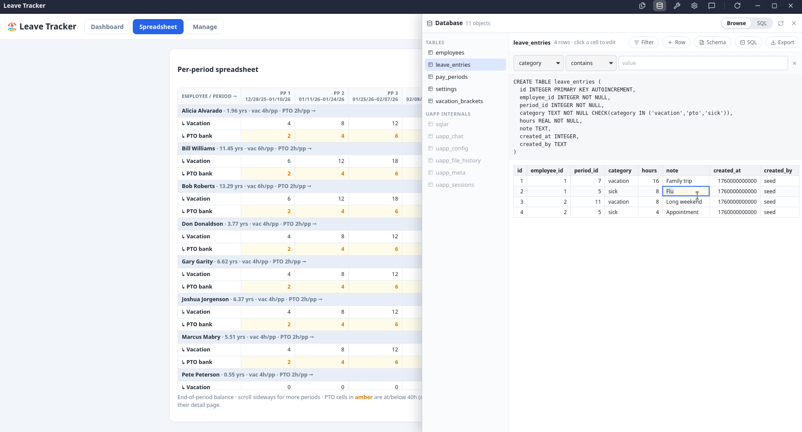
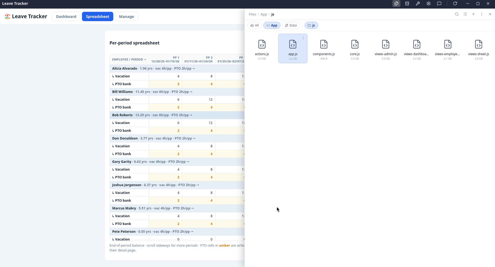
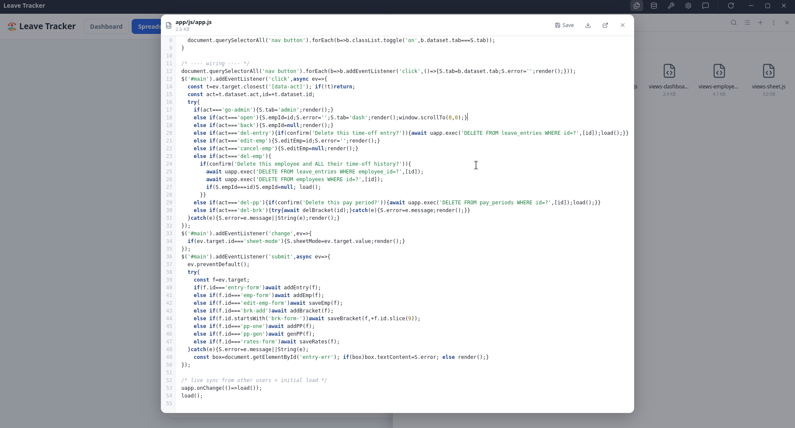

# uApp - single-file shareable apps

[](https://github.com/JoshTheDerf/uApp/actions/workflows/ci.yml)
[](LICENSE)


**uApps** (feel free to suggest a better name) are self-contained SQLite archive files which contain application logic, files, and arbitrary user data tables. They can be written with or without AI assistance, and [include tools](docs/TOOLS.md) for managing their contents directly or through AI. They are designed to only be able to access their internal files and files the user shares with them.

Revision history, AI chat logs, and such are integrated into the `.uapp`, allowing for rudimentary version control and analysis.



*An example employee-leave tracking app built with GLM 5.3 and Vanilla JS inside a .uapp. (Names and data are made up)*

**Installation**: The desktop and Android apps can be installed from [GitHub releases](https://github.com/JoshTheDerf/uApp/releases), but nothing is code-signed yet, so installation on Windows, macOS, and Android will be a pain.

## Online demo

A version of the backend compiled to WebAssembly is hosted [here](https://thederf.com/uapp/demo), along with several demo apps.
How to use:

1. Open a demo app (or set up a new one.)
2. Use the file browser and SQLite browser tools to modify it, or hook up an AI API key to modify the application for you.
3. Download the .uapp file directly (containing user data) or as a template (without user data) to re-use it later.
4. Drag a template .uapp onto a running app to update its code while keeping the data already in it.

[https://thederf.com/uapp/demo](https://thederf.com/uapp/demo)



*The demo launcher itself is a .uapp*

Most desktop features are available in the web demo apart from database encryption.

**Note:** You can use the .uapp files from the web demo with the desktop and Android programs for system integration. With them installed, you can double click/open a .uapp file with full read-write capability.

## Why?

One of the most helpful uses of AI in my workplace has been creating specialized internal tooling for oddly-specific staff workflows that are otherwise handled painfully with a combination of manual workflows and spreadsheets.

But deploying such tools is pain. If the application doesn't quite fit in a single HTML file, I either have to build native executables or shoehorn it into our existing web hosting, database, and access control infrastructure, which is not the right place for such tooling.

Staff often miss their old spreadsheets and documents anyway. When they need to modify, share, and reason about the process, a file on their local hard drive is easier to work with than an opaque application on shared server infrastructure.

So, uApps are designed to make building, sharing and modifying a single-purpose application was as straightforward as sharing a spreadsheet. This lets me send one by email, flash drive, or internal network share with no extra server infrastructure behind it, and staff can customize their own copy or pass a modified version along. If something goes wrong, a user can send me their .uapp file so I can examine what went wrong and roll back as needed.

## How does it work?

A .uapp file is simply a SQLite database containing:
1. Compressed web app files in [sqlar](https://sqlite.org/sqlar.html) archive format + some housekeeping tables.
2. Whatever other tables and data the user wants to store.

When a .uapp file is opened, a built-in web server serves the files in the `/app` folder inside the archive, and injects some plumbing to allow the application to read and write back to the `.uapp` database.

On top of that, a number of internal utilities are exposed:
1. An embedded AI chat window with tools to allow building out a frontend and database. Sub-agents, multiple chats, and file revision history are supported. Chats are stored inside the `.uapp`.

   

2. A SQL browser frontend with support for exploring the database and running queries.

   

3. A file browser with support for viewing, editing, uploading, and downloading stored files.

   

   

Saving a copy of the running .uapp is supported, as well as saving a "template" copy that contains app code and tables without user data.

## Design choices

### API

A JSON-RPC-over-WebSocket API connects the frontend to the backend and app shell. It's intended to be as simple as possible to allow smaller models to build apps without a ton of contextual or framework information.

Embedded apps use a tiny client and vanilla JS:

```html
<script src="/uapp.js"></script>
<script>
  const r = await uapp.query("SELECT * FROM jobs WHERE status=?", ["open"]);
  await uapp.exec("INSERT INTO jobs(title, created) VALUES(?,?)", [t, Date.now()]);
  uapp.onChange(refresh);   // fires when the app's data changes
</script>
```

### App actions

AI designed `.uapp`s are *encouraged* by the system prompt to expose their business logic as named actions, which in turn exposes them to the AI chat as well, allowing the AI chat window to function both as an app architect and as a "copilot".

Correspondingly, apps can call every tool the AI models have access to.

```js
uapp.action("add_employee", {
  description: "Add an employee. hired is YYYY-MM-DD.",
  params: { name: {type: "string"}, hired: {type: "string"} },
}, async ({name, hired}) => {
  await uapp.exec("INSERT INTO employees(name, hired) VALUES(?,?)", [name, hired]);
  return {ok: true};
});
```

### "Installation" of uApps.

The `install` button in the top bar provides a launcher entry for a given `.uapp` in the applications menu/Start Menu/Android Home Screen. It's possible to set custom app icons for this purpose.


- **Linux**: A user-local .desktop file.
- **Windows**: A Start Menu + Desktop shortcut
- **macOS** (untested): a `.app` bundle in `~/Applications`
- **Android**: A launcher shortcut using `ShortcutManagerCompat.requestPinShortcut`

## Known limitations

* **Multiple concurrent users** are not explicitly supported yet. It will probably work on the same system, writing over a network drive will likely cause corruption.
* **Cloud sync may cause issues** - A sync with the sqlite file mid-transaction may cause all sorts of issues. Odds are it will probably work, but there's a nonzero chance you may encounter corruption.
* **macOS and iOS untested** - I have neither a macOS nor an iOS device, so I can't test on those platforms. It should at least function on macOS, but not sure about iOS.
